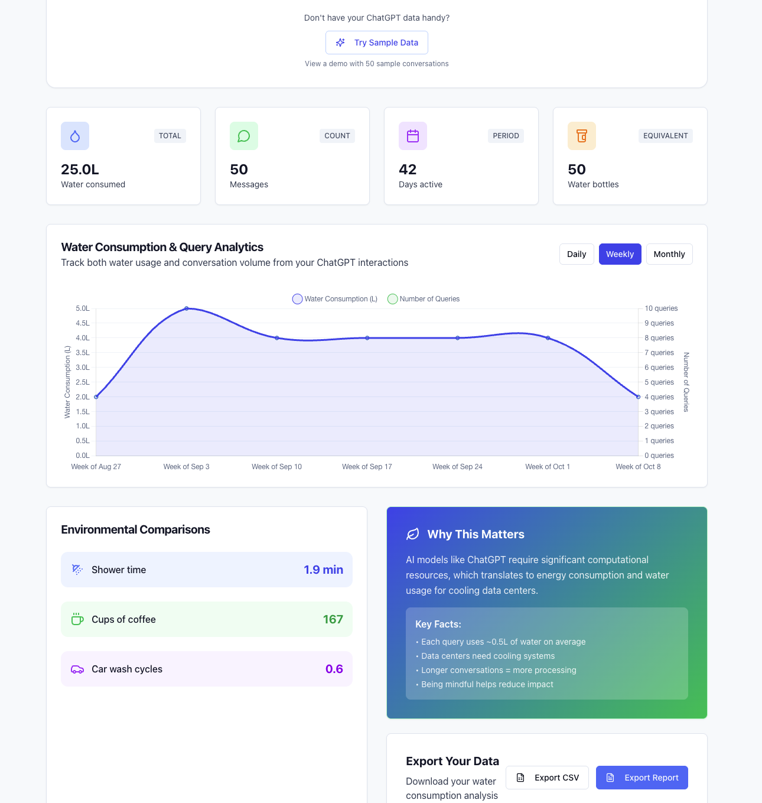

ChatGPT Water Impact Analyzer
==============================

A simple, visual tool to analyze the water consumption impact of your ChatGPT usage. Drop in your ChatGPT export `.zip` (or `conversations.json`) and get instant insights into your environmental footprint.

## 🚀 Live Demo

**[View Live Demo →](https://your-deployment-url.vercel.app)**

> Upload your ChatGPT data or click **"Try Sample Data"** to see instant analytics without any setup!

## 🖼️ Screenshot



*Upload your ChatGPT export and instantly see your water consumption visualized with meaningful comparisons and analytics*

> **Note:** Don't have your ChatGPT data? Try the **"Try Sample Data"** button to see a live demo!

Why this exists
---------------

Large language models consume water indirectly through data center cooling and power generation. This project turns your personal ChatGPT conversation history into practical water consumption stats and relatable comparisons you can understand.

What it does
------------

- Calculates estimated water use from your conversations over time
- Visualizes daily/weekly/monthly trends
- Provides relatable comparisons (e.g., showers, glasses of water)
- Works with ChatGPT export `.zip` or `conversations.json`

Getting your ChatGPT data
-------------------------

1. Open ChatGPT → Settings → Data Controls → Export data
2. You’ll receive an email with a download link to a `.zip` containing `conversations.json`
3. Upload that `.zip` here (preferred) or extract and upload `conversations.json`

Quick start
----------

- Node.js 20+
- Install and run:

```bash
npm install
npm run dev
```

Open `http://localhost:5173` and upload your `.zip` or `conversations.json`.

Deployment
----------

This project is configured for easy deployment to Vercel:

```bash
# Install Vercel CLI
npm i -g vercel

# Deploy
vercel
```

Or click: [](https://vercel.com/new/clone?repository-url=https://github.com/YOUR-USERNAME/watermarkai)

Tech stack
---------

- React + TypeScript, Vite, Tailwind, shadcn/ui
- Chart.js for visualizations
- JSZip for in-browser ZIP parsing
- Express (server), Drizzle ORM, Neon (optional server features)

Background
---------

This is a weekend project exploring how to make AI environmental costs tangible. It’s not a perfect lifecycle analysis—just a personal lens on usage.

License
------

MIT


